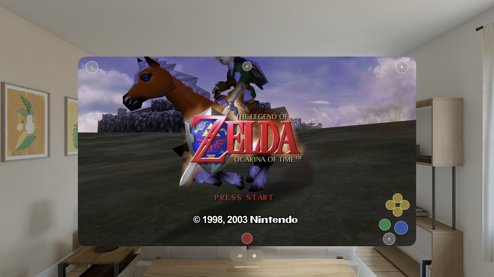

# Ship of Harkinian for iPhone & Apple Vision Pro

Play **The Legend of Zelda: Ocarina of Time** on your iPhone and Apple Vision Pro —
the full quest with saves, the Ship of Harkinian enhancements menu, HD/4K texture
packs, game controllers and a tunable touch layout, and on Vision Pro a stereoscopic
**3D mode** that puts the game on a world-locked panel floating in your room with
real depth.

Built on [Ship of Harkinian](https://github.com/HarbourMasters/Shipwright) (Harbour
Masters' native Ocarina of Time port) and
[libultraship](https://github.com/HarbourMasters/libultraship), rendering natively on
**Metal** — no translation layer. 100% vibe coded with lots of passion and attention
to detail.



*Ocarina of Time on Apple Vision Pro — a resizable window floating in your room, with the on-screen touch layout. The same build also runs in stereoscopic 3D.*

---

## Install

**Add the SideStore source** — the easiest path, and the app auto-updates when new
versions ship:

| Device | Source URL |
| --- | --- |
| iPhone / iPad | `https://raw.githubusercontent.com/rebelancap/harbourmasters-ports/main/apps-ios.json` |
| Apple Vision Pro | `https://raw.githubusercontent.com/rebelancap/harbourmasters-ports/main/apps-visionos.json` |

In [SideStore](https://sidestore.io) / [AltStore](https://altstore.io): *Sources → **+** →
paste the URL*, then install Ship of Harkinian. These are shared sources — they also
carry the other HarbourMasters ports as they ship.

**Getting SideStore onto your device** — on both platforms SideStore itself is installed
with **iloader**:

- **iPhone / iPad:** [iloader](https://github.com/nab138/iloader).
- **Apple Vision Pro:** my [iloader fork](https://github.com/rebelancap/iloader/releases#release-visionos) —
  upstream doesn't do visionOS. It runs on an Apple Silicon Mac and pairs with the headset
  over Wi-Fi: no cable, no Dev Strap, no Xcode.

Then add the source in SideStore exactly as above.

**Prefer a manual install?** Download `soh-*-iOS.ipa` / `soh-*-visionOS.ipa` from the
[latest release](../../releases/latest) and install it through SideStore/AltStore yourself
(iPhone can also use [Sideloadly](https://sideloadly.io)).

Then **add your Ocarina of Time ROM** — the app walks you through it on first
launch.

## Texture packs (strongly recommended)

The port supports Harbour Masters' `.o2r` mods, and the one worth installing is
**[OoT Reloaded](https://github.com/GhostlyDark/OoT-Reloaded-SoH)** by GhostlyDark — a
UHD texture pack in two flavours.

| Device | Recommended | Why |
| --- | --- | --- |
| **iPhone** | **HD** | Out-resolves the phone's panel already; stays cool and holds 100–120 fps. The 4K pack runs but pushes the phone into sustained thermal throttling for detail you cannot see at that screen size. |
| **Apple Vision Pro** | **4K** | The headset renders at a far higher effective resolution and has the GPU headroom — 4K holds a locked 120 fps with thermals barely off idle. This is where the pack earns its size. |

- **Project & releases:** [github.com/GhostlyDark/OoT-Reloaded-SoH](https://github.com/GhostlyDark/OoT-Reloaded-SoH)
  ([releases](https://github.com/GhostlyDark/OoT-Reloaded-SoH/releases))
- **Downloads**:
  [evilgames.eu/texture-packs/oot-reloaded.htm](https://evilgames.eu/texture-packs/oot-reloaded.htm) —
  grab the SoH `HD OTR` (iPhone) or `4K OTR` (Vision Pro)

**Installing:** extract the `.7z` on a computer, then copy the resulting `.o2r` into
*On My iPhone / Apple Vision Pro → Ship of Harkinian → **mods*** in the Files app and
relaunch. The pack shows up once **Enable Mods** is on (*Settings → Mod Menu → **Enable
Mods*** in the game's menu) — on this build that's on by default, so if you still see the
vanilla textures, that's the switch. Turn it off to compare against vanilla.

> **4K is big:** it extracts to a single ~23 GB `.o2r`, so keep ~24 GB free. Install
> **one** pack at a time. The 4K pack is strongly recommended for Vision Pro 3D mode.

## Features

- The full quest with saves, audio and music, and cutscenes
- The **Ship of Harkinian enhancements menu** — the reason these ports exist: higher
  frame rates, widescreen, and the whole quality-of-life catalogue
- **In-app ROM extraction** — no PC tools, no companion app
- **Game controllers** (Backbone, DualSense, Xbox…) with menu-aware navigation
- **Touch controls** built for the game: floating analog stick, N64 button cluster with
  C-buttons, Z as momentary-or-double-tap-lock, and a **layout customizer** — drag any
  button, scale 70–140%, left-handed mirror, opacity, haptics, and **per-button
  hide/show** so you can drop the buttons you never use
- **60 / 120 Hz** (ProMotion) and a supersampling slider for extra sharpness
- Texture packs and other `.o2r` mods via drag-and-drop in Files
- On-screen fps + thermal readout for tuning
- **Apple Vision Pro:** a free-resizing 2D window rendering at true 4K, plus a
  **stereoscopic 3D mode** — the game on a world-locked panel floating in your room,
  with foveated rendering for full-resolution clarity where you're looking, spatial audio
  anchored to the screen, and live-tunable stereo depth, focus, screen size/distance/height,
  surroundings dimming, and a recenter button

## Requirements

- iPhone on **iOS 15+**, or **Apple Vision Pro** (visionOS 2+)
- **SideStore**, installed with [iloader](https://github.com/nab138/iloader) — Apple Vision
  Pro needs my [visionOS fork](https://github.com/rebelancap/iloader/releases#release-visionos)
  and an Apple Silicon Mac
- Your own Ocarina of Time ROM

## FAQ

**Do I need a PC to extract the ROM?** No — extraction runs inside the app on your device.

**Which texture pack?** HD on iPhone, 4K on Vision Pro (see the table above).

**The app stopped launching after about a week?** Apps sideloaded with a free Apple
account expire after 7 days (paid developer accounts last a year). SideStore/iloader
refresh them automatically in the background — open the sideloading app and let it
re-sign.

**Found a bug, or it crashed?** The app keeps its own logs, and its folder is visible in
**Files** — open *On My iPhone / Apple Vision Pro → Ship of Harkinian* and grab:

- `crash.txt` — a backtrace, written if the app died (this is the important one)
- `logs/` — the newest `.log` file

Attach those to a [GitHub issue](../../issues) or send them over Discord, along with what
you were doing and whether a texture pack was installed. A crash without `crash.txt` is
usually the app being killed for memory — worth saying so, and which area you were in.

---

## Building from source

Requires macOS with Xcode and `cmake` (`brew install cmake`).

```sh
scripts/bootstrap.sh          # clone + pin upstream Shipwright (submodules recursive)
scripts/build-oracle.sh       # native macOS build — generates the soh.o2r asset archive
scripts/extract-oot-o2r.sh    # build oot.o2r from your ROM (for the simulator)

scripts/build-sim.sh          # iOS Simulator build
scripts/run-sim.sh            # install + launch + screenshot

scripts/build-ios.sh          # signed iPhone build
scripts/build-visionos.sh     # signed Apple Vision Pro build
```

Upstream Shipwright is vendored **unmodified and pinned by commit**; every local change is
a reviewable patch in `overlay/patches/`, applied by `scripts/apply-overlay.sh` (a patch
that fails to apply fails the build). The iOS/visionOS app shell lives in `app/ios/`.

## Credits & license

- [Ship of Harkinian / Shipwright](https://github.com/HarbourMasters/Shipwright) by
  **Harbour Masters** and contributors — the port this is built on
- [libultraship](https://github.com/HarbourMasters/libultraship) (MIT),
  [ZAPDTR](https://github.com/HarbourMasters/ZAPDTR) (MIT), and OTRExporter
  (© 2022 Harbour Masters) — the platform layer and asset pipeline
- [OoT Reloaded](https://github.com/GhostlyDark/OoT-Reloaded-SoH) texture pack by
  **GhostlyDark**
- THE LEGEND OF ZELDA: OCARINA OF TIME © **Nintendo**. This project is not affiliated
  with or endorsed by Nintendo, and ships no Nintendo content.

This port's own code — the app shell (`app/ios/`) and the overlay patches — is released
under the **MIT License** (see [`LICENSE`](LICENSE)). It builds on upstream components under
their own terms: libultraship and ZAPDTR (MIT), OTRExporter (© Harbour Masters).
